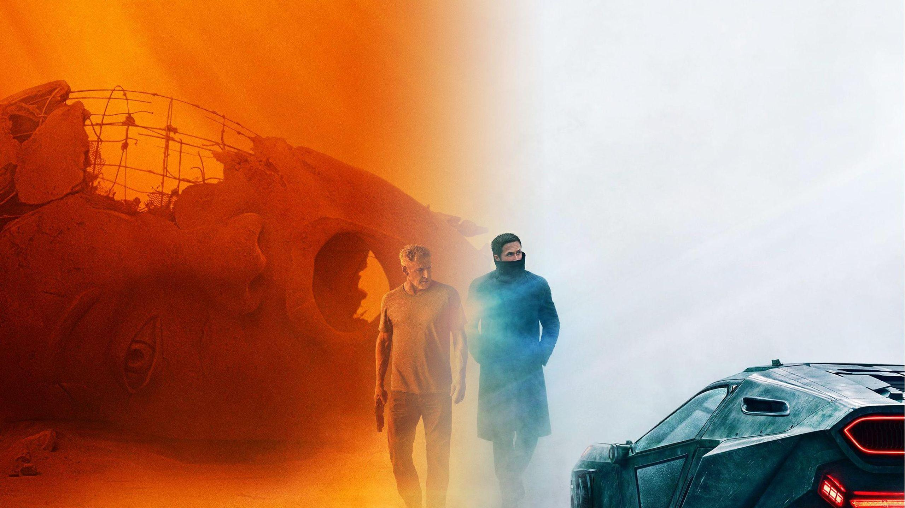
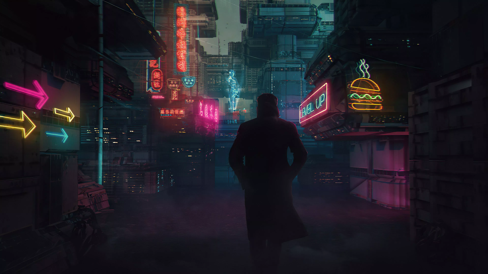
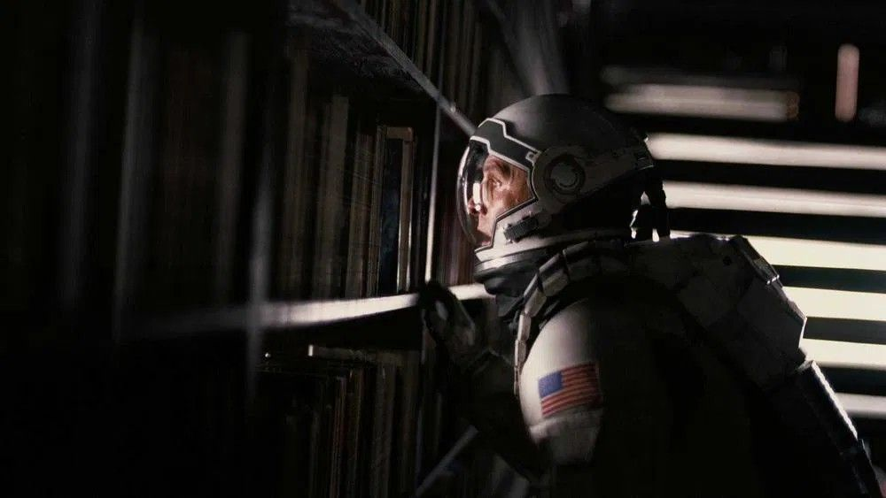
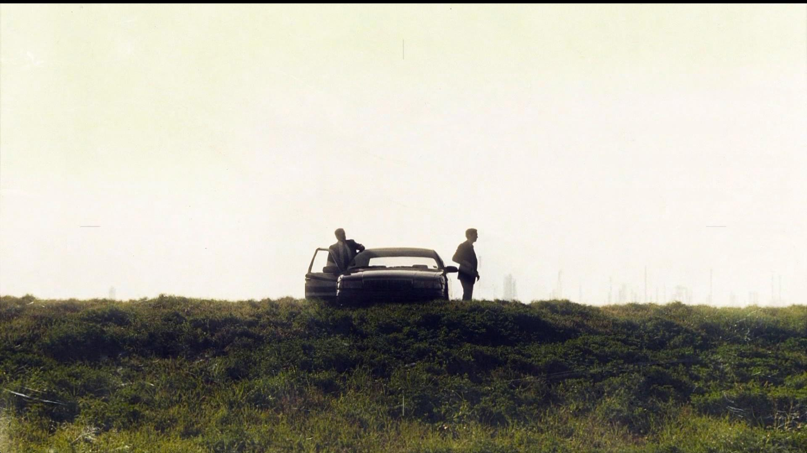
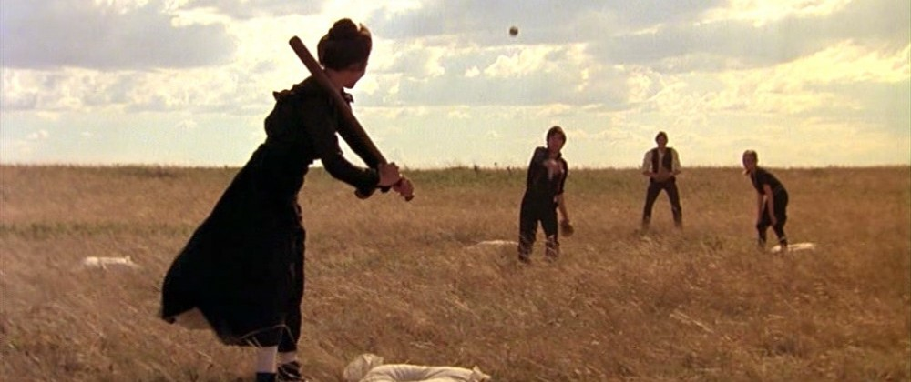
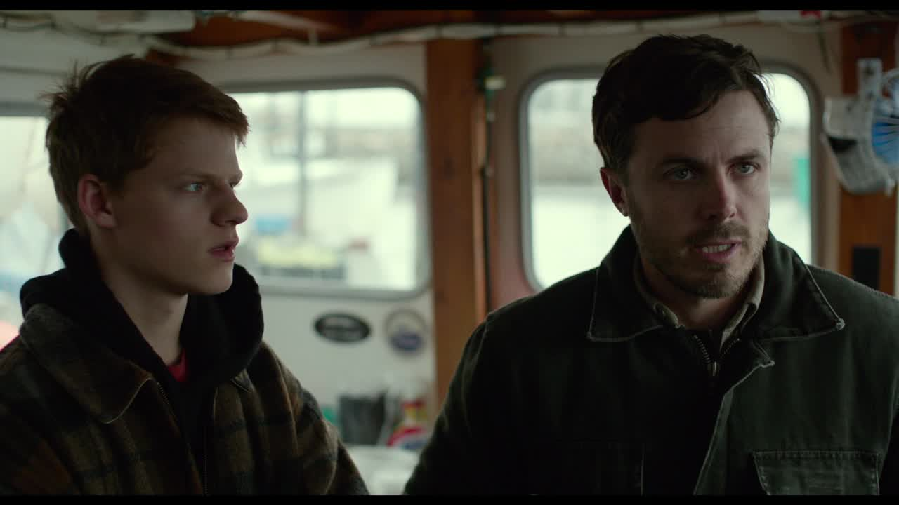
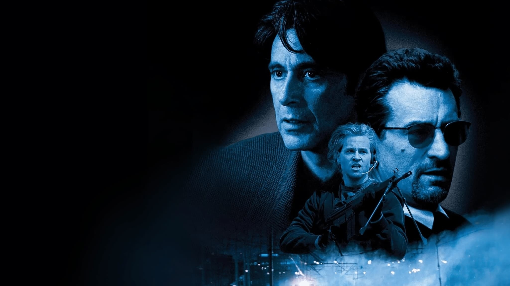
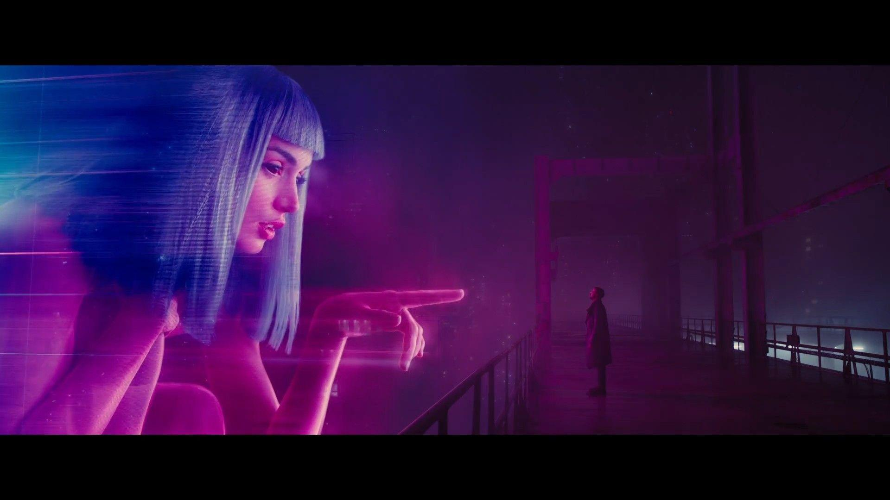

<!-- ================= HERO ================= -->

  

<h1 align="center">
Life in Frames.
 
Code in Functions.
</h1>

Software Engineering • Backend • Competitive Programming • Cinema

<!-- Banner goes here -->

## 🎬 Opening Credits

Hi, I'm **Mayank Raj**.

I'm a Petroleum Engineering undergraduate at **IIT (ISM) Dhanbad** who discovered that I enjoy building software more than drilling wells.

Lately I've been spending most of my time learning database systems, building backend applications, and solving competitive programming problems.

When I'm away from my keyboard, I'm usually watching films that stay with me long after the credits roll.

## 🎥 Director's Commentary

  

Every project tells a story.

Mine usually begin with curiosity—trying to understand how things work beneath the surface—and end with countless hours spent debugging, learning, and rebuilding.

Lately, that curiosity has been pulling me toward:

- 🗄️ Database Systems & Storage Engines
- ⚙️ Backend Engineering
- 🌐 Distributed Systems
- 🧩 Competitive Programming
- 📚 Writing cleaner, more maintainable code

Outside of programming, I spend an unreasonable amount of time watching films. I admire stories that trust the audience, characters that feel human, and directors who pay attention to the smallest details. I try to bring that same attention to detail into the software I build.

## 🎞 Currently In Production

These are the stories I'm working on at the moment.

- 🗄️ Implementing **BusTub**, the CMU educational database system
- ⚙️ Strengthening my understanding of backend engineering and distributed systems
- 🧠 Practicing competitive programming with a focus on Codeforces
- 📚 Exploring operating systems, networking, and computer systems
- 🚀 Building projects that make me a better software engineer, one commit at a time.

## 🎥 Production Equipment

 

 

> "Every frame has a purpose. Every line of code should too."

# 🎬 Filmography

  

Every project has been another opportunity to learn, experiment, and become a better engineer.

---

### 🤖 OrchestrAI

> *An AI orchestration platform for coordinating multiple agents and workflows.*

**Tech:** Python • FastAPI • LLMs • AI Agents

- Designed to orchestrate AI workflows through a unified interface.
- Focused on modularity, extensibility, and scalable agent execution.
- Currently under active development.

---

### 🎟 Chillr

> *A full-stack ticket booking ecosystem.*

**Tech:** React Native • Node.js • Express • MongoDB • Clerk

- Complete booking flow with authentication.
- Modern UI built using Expo Router.
- Designed with scalability and usability in mind.

---

### 🗄️ CMU BusTub

> *Building a database system from the ground up.*

**Tech:** C++ • CMake

- Implementing core DBMS components.
- Exploring storage engines, indexing, and query execution.
- Following Carnegie Mellon Database Systems.

---

### 📞 WebRTC Video Calling

> *Real-time communication over the web.*

**Tech:** React • Express • Socket.IO • WebRTC

- Secure peer-to-peer audio/video communication.
- HTTPS signaling server.
- Multi-user video conferencing.

---

### 🧠 LLM Policy Assistant

> *Retrieval-Augmented Generation for policy documents.*

**Tech:** FastAPI • LanceDB • Groq • Python

- Semantic document retrieval.
- PDF ingestion and processing.
- AI-powered policy question answering.

---

### 🔥 CF Daily

> *A browser extension for staying consistent with competitive programming.*

**Tech:** JavaScript • HTML • CSS

- Daily Codeforces reminders.
- Progress tracking.
- Productivity-focused design.

# 🏆 Training Montage

  

Every engineer has a training montage.

Mine happens to involve hundreds of programming contests, countless wrong answers, late-night debugging sessions, and the satisfaction of watching difficult problems slowly become familiar.

Competitive programming has shaped the way I approach software engineering. It has taught me to think under pressure, recognize patterns, and break complex problems into smaller, manageable pieces—skills I carry into every project I build.

 

  
  

 

  
  &nbsp;
  

# 🎞 Favorite Frames

Some stories don't end when the credits roll.

These are a few films, shows, and moments that have stayed with me—not because they had the biggest twists or the loudest action, but because they continue to influence the way I think about people, curiosity, ambition, loneliness, craftsmanship, and storytelling.

 

  
  
  

  
  
  

  
  
  

  
  

 

> *"Every frame a painting. Every story a lesson."*
# 📊 Production Log

Every commit tells part of the story.

While projects capture milestones, the journey is really made up of the small improvements—the late-night debugging sessions, the experiments that didn't work, and the countless commits that slowly turn ideas into software.

 

  
  

 

  

 

  <i>"Every commit is another frame in the story."</i>

## 🎬 Closing Credits

...
